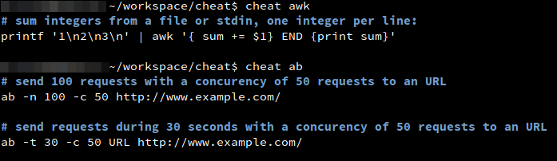

# Cheat

Une implémentation de l'outil [cheat](https://github.com/chrisallenlane/cheat) en NodeJS.



**/!\ En développement ! L'API n'est pas stable et peut évoluer régulièrement !**

## Installation

```
git clone https://github.com/Bornholm/cheat.git
cd cheat
sudo npm link
cheat
```

## Configuration

Cette implémentation ajoute la possibilité de définir des _stores_ permettant d'aller chercher les _cheatsheets_ sur différents supports. Par défaut, deux stores sont déjà disponibles: `http` et `local`.

Les stores sont configurables via le fichier `~/.cheat/config.json`.


### local

Le store `local` reproduit  globalement le comportement de l'outil _cheat_ initial.

**Options**
- **dir** [Optionnel] Le chemin d'accès au dossier contenant les _cheatsheets_. Si il n'est pas spécifié, le store ira chercher dans le dossier `~/.cheat`.

**Exemple de configuration**
```
{
  "stores": [
    {
      "module": "../lib/stores/local",
      "options": {
        "dir": "/home/user/my_cheatsheets"
      }
    }
  ]
}
```

### http

Le store `http` utilise une requete HTTP afin de trouver les _cheatsheets_. Si `200 <= statusCode < 400`, le contenu de la réponse est affiché.

**Options**
- **endpoint** [Requis] L'URL de recherche des _cheatsheets_. Le token `%s` sera automatiquement remplacé par la commande recherchée.
- **request** [Optionnel] Paramètres à passer à la méthode `request()`. Voir le module [request](https://github.com/mikeal/request)

**Exemple de configuration**
```
{
  "stores": [
    {
      "module": "../lib/stores/http",
      "options": {
        "endpoint": "https://raw.github.com/chrisallenlane/cheat/master/cheatsheets/%s"
      }
    }
  ]
}
```


